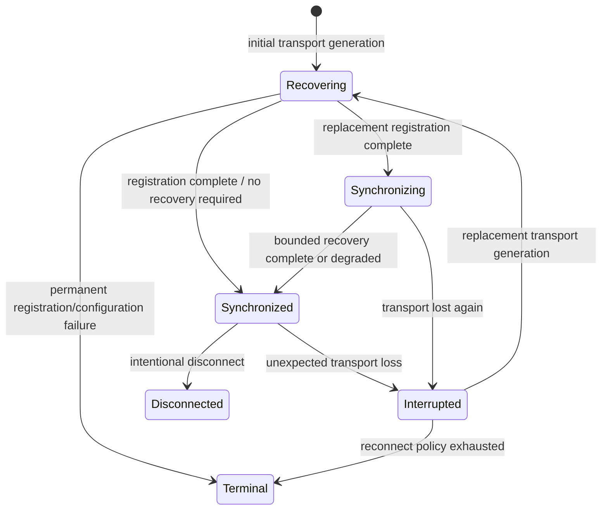

# Phase 31 — Connection Continuity State Machine

Phase 31 makes connection continuity an explicit, generation-owned product
concept. A transport interruption is recoverable session state, not automatic
destruction of the IRC workspace.

## 1. Previous lifecycle model

`ServerSessionState` already described detailed transport and IRC registration
steps (`Connecting`, `CapNegotiation`, `Registering`, and `Registered`). The
application treated `Registered` as ready for all purposes and started bounded
reconnect history from a registration callback. That left a gap between a
replacement IRC registration and a workspace that had finished continuity
reconciliation.

## 2. Authoritative continuity model

The network/session layer now owns `ConnectionContinuityStateMachine` and
publishes `ConnectionContinuitySnapshot` in every `ServerSessionSnapshot`.
The existing detailed protocol state remains available for wire-level behavior;
continuity is the authoritative answer to whether the workspace is current.

## 3. State definitions

The exact implemented continuity states are:

* `Disconnected`: no active continuity episode; intentional shutdown also ends
  here and is marked with `IsIntentional`.
* `Interrupted`: the prior generation lost transport unexpectedly and recovery
  may still be attempted.
* `Recovering`: a generation-owned replacement transport/session is being
  established. TCP/TLS success alone does not leave this state.
* `Synchronizing`: IRC registration and required capability/authentication
  work completed, but bounded continuity history is still pending.
* `Synchronized`: the current generation is authoritative for live operation.
* `Terminal`: recovery was abandoned, exhausted, or made impossible by a
  permanent failure.

The detailed `ServerSessionState.Registered` value is intentionally retained:
it means IRC registration completed, while `Continuity.State` distinguishes
whether recovery still remains.

## 4. Ownership and generation rules

Each transport owns a `ConnectionEpoch`. The continuity snapshot carries the
same generation number. Transition APIs reject a generation that is not the
current owner and return no transition. This applies to interruption,
registration completion, synchronization completion, and terminal failure.

Replacing a `ServerSession` for an explicit reconnect carries only a bounded
replacement marker and previous generation number. Durable workspace state and
transport objects are never copied into the new session.

## 5. Interruption classification

Transient `RemoteClosed`, network, TLS, DNS, timeout, and other failures marked
transient enter `Interrupted`. The existing reconnect/backoff policy then
controls replacement attempts. Registration rejection, protocol failure, and
other non-transient failures enter `Terminal`. Intentional disconnect and
shutdown enter `Disconnected` and do not schedule continuity recovery.

## 6. Reconnect registration barrier

The replacement generation must complete the existing CAP, SASL, password,
NICK/USER, welcome, ISUPPORT, and capability model work before it can enter
`Synchronizing`. A writable socket or transport `Connected` state is not a
continuity success. Optional capabilities remain optional; a server without
SASL or history can still register when policy permits.

## 7. Synchronization barrier

On a replacement generation, welcome/registration moves continuity to
`Synchronizing`. `NetworkSessionManager` then runs the existing bounded
reconnect orchestration and calls `ServerSession.CompleteSynchronization` with
the generation it started with. Only that generation can move to
`Synchronized`.

The outcome is recorded as `Recovered`, `NoGapObserved`, `Unsupported`,
`Partial`, or `Failed`. `Synchronized` means that all applicable bounded work
has been exhausted; it does not claim protocol-level losslessness when the
server cannot prove it.

## 8. CHATHISTORY-supported behavior

When CHATHISTORY, BATCH, server-time, and message-tags are usable, the existing
bounded reconnect process is retained:

1. capture canonical pre-disconnect boundaries;
2. observe the first canonical post-reconnect event when possible;
3. use exact BETWEEN repair for a safe interior gap;
4. fall back to bounded LATEST or bounded query TARGETS discovery;
5. process playback through the existing canonical history and relationship
   machinery; and
6. complete the synchronization barrier.

## 9. Behavior without CHATHISTORY

The client does not issue unsupported history commands and does not remain
stuck in `Synchronizing`. It completes with `Unsupported`, leaving the live
replacement session usable while accurately communicating that the outage
cannot be proven lossless.

## 10. Live traffic during synchronization

No new offline queue was introduced. Existing serialized workspace dispatch,
canonical message identity, durable logging, and semantic duplicate filtering
continue to process live events while playback is in progress. Historical
events carry server-playback provenance; live events retain live provenance.
Overlap is deduplicated by canonical msgid and existing timestamp/identity
rules, including TAGMSG reactions without blank transcript rows.

## 11. Repeated interruption

An interruption cancels the manager's active synchronization token. A second
generation can then enter `Recovering`, and a second interruption can supersede
it. Old history tasks may finish their own bounded await, but generation checks
prevent them from completing the current barrier or mutating the current
workspace projection.

## 12. Conversation preservation

Channels, queries, durable history, navigation state, search indexes, reply
relationships, reaction state, and network identity remain application-owned.
Reconnect refreshes server membership and channel participant state; it does
not recreate conversation objects or erase durable transcript state.

## 13. Query behavior

Queries are retained because they are durable workspace conversations rather
than server channel memberships. Existing identity evidence, canonical query
keys, bounded TARGETS discovery, and nick/account continuity policies remain in
charge of deciding whether a recovered private conversation can be reused.
Reconnect does not create a duplicate query merely because a transport was
replaced.

## 14. Relationship behavior

Reply and reaction routing continues to use canonical parent message ids and
conversation scope. The continuity barrier does not reinterpret relationship
events. Existing deduplication preserves replies, reactions, unreactions,
multi-actor aggregation, and the no-blank-TAGMSG rule across playback and live
overlap.

## 15. UI/application projection

`NetworkWorkspace.ContinuityState`, `ServerStatusView.ContinuityState`, and
`ContinuityText` expose the lifecycle separately from the existing protocol
`State`/`StateText`. The WPF server-status view displays continuity prominently
and retains the detailed IRC state as a secondary line. The network tree uses
the continuity label.

## 16. Send behavior during recovery

Application command validation now requires both IRC registration and
`ContinuityState.Synchronized` for user sends, replies, reactions, channel
operations, and interactive history requests. Commands used internally to
finish registration, rejoin channels, and perform synchronization remain
owned by the session layer. No offline outbound queue or delivery guarantee is
introduced; a user action during interruption/recovery is rejected explicitly.

## 17. Diagnostic and observability model

`ConnectionContinuityStateChangedEvent` reports previous/current state and a
bounded snapshot containing generation, previous generation, transition reason,
interruption failure kind, registration completion, synchronization requirement,
reconnect activity, episode start, outcome, and detail. The application status
view records stable interruption/recovery/synchronization transitions without
logging credentials or low-level retry noise.

## 18. Invariants

The implementation enforces these invariants:

1. only the current generation can enter `Synchronized`;
2. `Synchronized` requires registered IRC state and a completed barrier;
3. a dead epoch cannot publish live semantic state;
4. intentional disconnect cannot enter `Interrupted` recovery;
5. one manager synchronization task is active per current generation;
6. a history request is generation-bound and stale completion is ignored;
7. unsupported history completes the barrier as degraded;
8. durable conversation objects outlive transport replacement;
9. reconnect never fabricates canonical message identity; and
10. synchronization completion cannot erase newer live events.

## 19. Test evidence

Phase 31 adds deterministic core state-machine tests for initial registration,
replacement barriers, unsupported history, repeated interruption, stale
generation completion, intentional disconnect, and terminal failure. Session
tests verify ordered `Recovering → Synchronizing → Synchronized` transitions,
stale completion rejection, and intentional shutdown without replacement.
Application coverage verifies the continuity projection and query object
preservation across explicit replacement reconnect.

Existing reconnect, history/gap-repair, query, reply, reaction, durable reopen,
and Phase 1R tests remain part of regression validation.

## 20. Known limitations

Ordinary IRC servers may not expose enough information to prove every missed
event. A server without usable history therefore reaches `Synchronized` with
`Unsupported`, and bounded or unsafe exact-gap responses can reach it with
`Partial`. There is no offline outbound queue, server resume token, guaranteed
delivery, or cross-device synchronization in this phase.

## 21. Future nexIRC Server integration points

A future resume/session protocol can provide stronger continuity evidence,
server-side presence restoration, or lossless replay by feeding those results
into the same registration and synchronization barriers. It should improve the
outcome metadata (`Recovered` versus degraded outcomes), not replace the
generation-owned lifecycle or the application workspace model.
